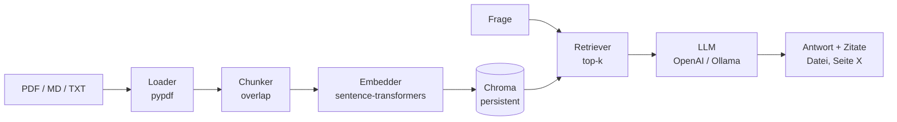

# nis2-rag-starter

> Mache NIS2-/KRITIS-Policies durchsuchbar — mit **Quellen-Referenzen** auf
> Seitenebene. Engineering-Demo von [Kritwerk](https://kritwerk.de).

[](https://github.com/kritwerk/nis2-rag-starter/actions/workflows/ci.yml)


---

## Was ist das?

Ein minimaler, lokaler **RAG-Pipeline-Starter** (Retrieval-Augmented Generation)
für interne NIS2-Compliance-Dokumente:

- PDFs, Markdown oder Text-Dateien indizieren
- Fragen in natürlicher Sprache stellen
- Antworten kommen **mit Quellen-Auszügen** (Datei + Seite)

Gedacht als **Architektur-Referenz** und Diskussionsgrundlage — kein
Produkt, keine Rechtsberatung.

## Architektur



## Quickstart

```bash
git clone https://github.com/kritwerk/nis2-rag-starter.git
cd nis2-rag-starter
python -m venv .venv && source .venv/bin/activate
pip install -e ".[openai]"

# 1) Beispiel-Policy indizieren
nis2-rag ingest examples/sample-policy.md

# 2) Frage stellen (mit OpenAI)
export NIS2_RAG_LLM_API_KEY=sk-...
nis2-rag ask "Innerhalb welcher Frist müssen Sicherheitsvorfälle gemeldet werden?"
```

### Offline-Variante mit Ollama

```bash
ollama pull llama3.1:8b
export NIS2_RAG_LLM_PROVIDER=ollama
export NIS2_RAG_LLM_MODEL=llama3.1:8b
nis2-rag ask "..."
```

### Konfiguration

Per Environment-Variable oder `.env`-Datei:

| Variable | Default | Zweck |
|---|---|---|
| `NIS2_RAG_LLM_PROVIDER` | `openai` | `openai`, `ollama`, `echo` |
| `NIS2_RAG_LLM_MODEL` | `gpt-4o-mini` | Modell-Name |
| `NIS2_RAG_LLM_API_KEY` | — | API-Key (OpenAI) |
| `NIS2_RAG_CHROMA_DIR` | `./chroma` | Persistenz-Verzeichnis |
| `NIS2_RAG_TOP_K` | `5` | Anzahl Retrieval-Treffer |
| `NIS2_RAG_CHUNK_SIZE` | `800` | Zeichen pro Chunk |

## Entwicklung

```bash
pip install -e ".[dev,openai]"
ruff check src tests
mypy src
pytest --cov=nis2_rag
```

## Disclaimer

Dieses Repo ist eine **technische Demo** und stellt **keine Rechtsberatung**
dar. Die mitgelieferte `examples/sample-policy.md` ist **fiktiv** und
spiegelt nicht den Wortlaut des NIS2UmsuCG, der BSI-Orientierungshilfen
oder der DVO 2024/2690 wider. Für produktive Anwendungen sind Quelle,
Aktualität und Vollständigkeit der Eingabedokumente selbst sicherzustellen.

Kunden-Daten dürfen **nicht** in diesen Index gegeben werden, ohne dass die
zugrundeliegenden LLM-/Embedding-Provider vertraglich (DPA) und technisch
(Region, Logging) entsprechend geprüft wurden.

## Lizenz

MIT — siehe [LICENSE](./LICENSE).

## Über Kritwerk

[Kritwerk](https://kritwerk.de) ist eine spezialisierte Engineering-Boutique
für **NIS2 / KRITIS / DORA** im deutschen Mittelstand:
Quick-Audits, Implementation-Sprints und Co-Pilot-Retainer.

Kontakt: [kontakt@kritwerk.de](mailto:kontakt@kritwerk.de)
